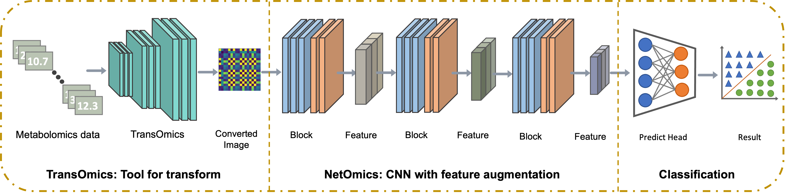
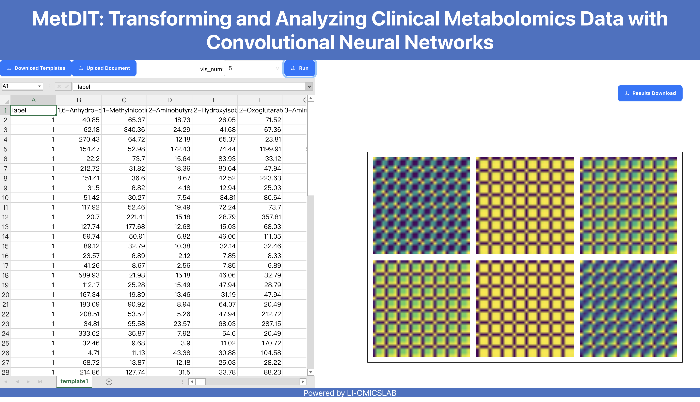
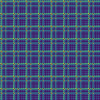
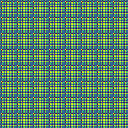
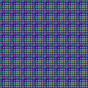
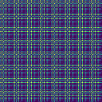
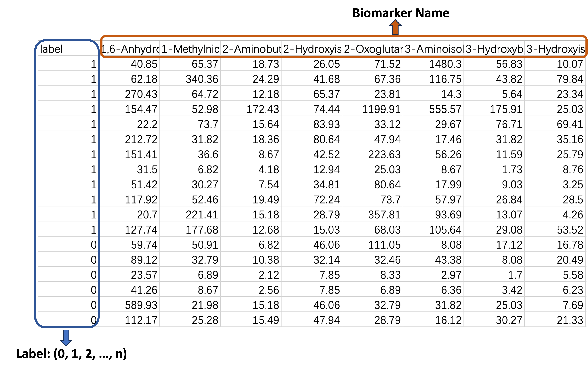
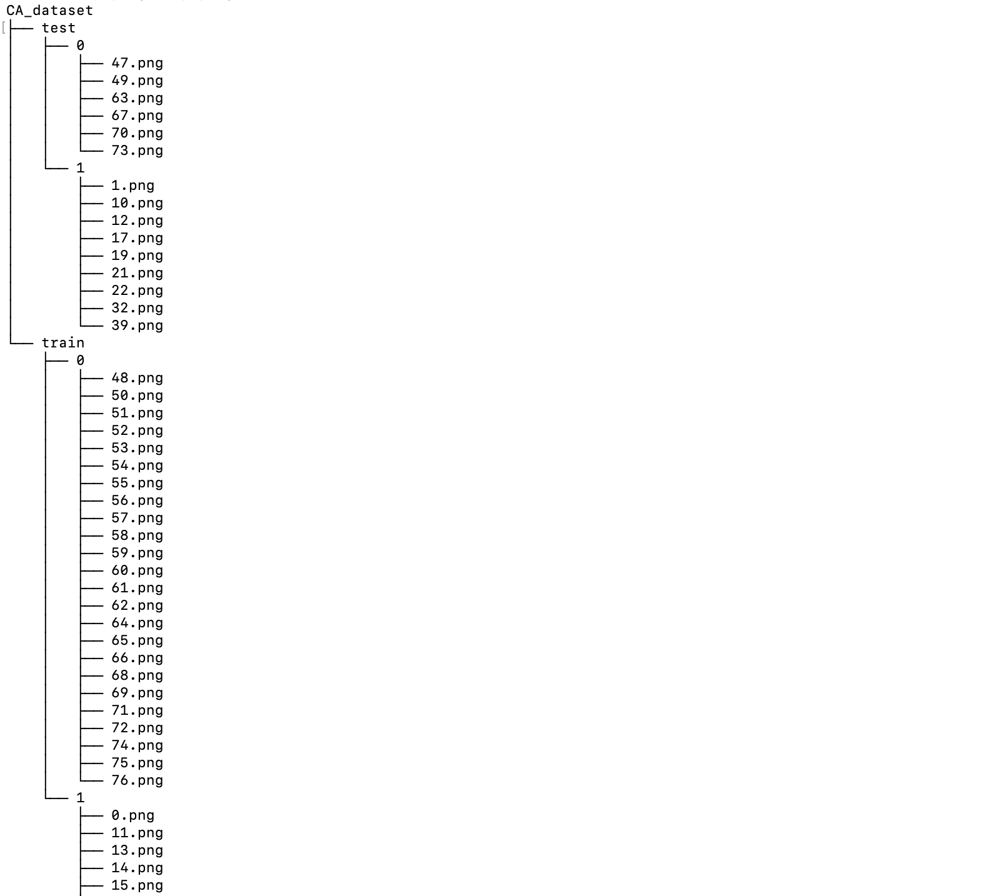
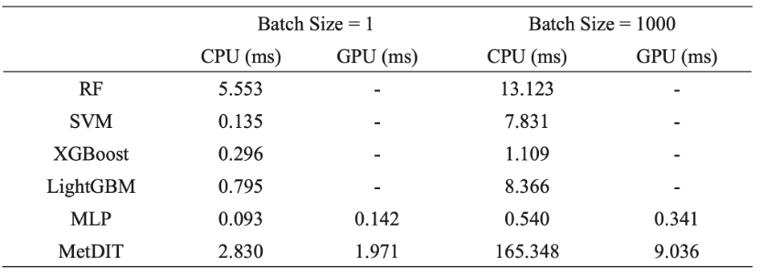

# MetDIT: Transforming and Analyzing Clinical Metabolomics Data with Convolutional Neural Networks

## Introduction
This paper introduces a new method called MetDIT, designed to effectively analyze intricate metabolomics data using deep convolutional neural networks (CNN). MetDIT comprises two components: TransOmics and NetOmics. Since CNN models have difficulty in processing one-dimensional (1D) sequence data efficiently, we developed TransOmics, a framework that transforms sequence data into two-dimensional (2D) images, while maintaining a one-to-one correspondence between the sequences and images. NetOmics, the second component, leverages a CNN architecture to extract more discriminative repre-sentations from the transformed samples.




## :high_brightness: Demo Tool

- We have developed a web application for TransOmics, providing a more user-friendly way to conduct trials on our proposed method. You can test the ***Data Transfer*** through the website [TransOmics](http://metdit.bioinformatics.vip/).

- Since the NetOmics needs GPU to finish the model training, the WebApp is not available now. We plan to finish it in the future. 

   

## Mian Results
We conduct extensive experiments on three benchmark dataset, including: **CA**, **ISR**, and **Fungal**. The model performance was evaluated using the area under the receiver operating characteristic curve (*AUROC*), *Precision*, *Recall*, and *Accuracy*.

### Results on CA

| Method | Accuarcy | Precision | Recall | F1-Score | 
|--------|----------|-----------|--------|----------| 
| Random Forest | 0.73 | 0.75 | 0.78 | 0.76 |
| SVM | 0.62 | 0.66 | 0.68 | 0.67 | 
| XGBoost | 0.76 | 0.78 | 0.83 | 0.81 | 
| LightGBM | 0.75 | 0.81 | 0.77 | 0.79 |
| MLP | 0.79 | 0.80 | 0.84 | 0.82 | 
| **MetDIT** | **0.93** | **0.93** | **0.93** | **0.93** |


### Results on ISR

| Method | Accuarcy | Precision | Recall | F1-Score | 
|--------|----------|-----------|--------|----------| 
| Random Forest | 0.75 | 0.49 | 0.52 | 0.48 |
| SVM | 0.73 | 0.51 | 0.59 | 0.55 |
| XGBoost | 0.78 | 0.58 | 0.71 | 0.64 |
| LightGBM | 0.76 | 0.54 | 0.70 | 0.61 |
| MLP | 0.79 | 0.65 | 0.78 | 0.71 |
| **MetDIT** | **0.94** | **0.95** | **0.94** | **0.94** |


### Results on Fungal

| Method | Accuarcy | Precision | Recall | F1-Score | 
|--------|----------|-----------|--------|----------| 
| Random Forest | 0.97 | 0.92 | 0.94 | 0.93 | 
| SVM | 0.96 | 0.94 | 0.95 | 0.94 |
| XGBoost | 0.96 | 0.88 | 0.91 | 0.89 | 
| LightGBM | 0.97 | 0.91 | 0.94 | 0.92 |
| MLP | 0.97 | 0.94 | 0.97 | 0.95 | 
| **MetDIT** | **0.98** | **0.96** | **0.96** | **0.96** |


## Environment

- The code is developed using python 3.8 on Ubuntu 20.04.
- The TransOmics and inference NetOmics can run on cpu. 
- If you want to train the NetOmics on custom dataset, Nvidia GPUs are needed. 
- This code is development and tested using one Nvidia GTX 3080 GPU with 12GB memory.  


## Quick start

### Installation

1. Clone this repo:
   ```
   git clone https://github.com/Li-OmicsLab/MetDIT.git
   ```

2. Install dependencies:
   ```
   pip install -r requirements.txt
   ```

### Example of TransOmics

The TransOmics is responsible for transferring metabolomics data into 2D images. It contains to parties: data pre-processing and image transfer. 

1. Into the subfolder of TransOmics:
    ```
    cd TransOmics
    ```


2. Data pre-processing:
   ```
   python 01-feature_process.py -ofp {your csv data path} -sfp {the path to save} -log -zs
   ```

- You can use the following example to run the demo dataset. 
    ```
    python 01-feature_process.py
    ```

3. Data generation:
    ```
    python 02-convert_by_cols.py -fn {the csv data path} -sp {the path to save converted images} -sz 32 -mt summation
    ```

- You can use the following example to run the demo dataset. 
    ```
    python 02-convert_by_cols.py
    ```

- The converted samples are show as follows (with 128 pix):

   
   

   
   

-------------

If you want use this code to your own **custom dataset**, please follow the following steps.

1. Create dataset
   
   Our code must be used on the format data to guarantee get the correct results. The data type is shown as follow.

   * The first line is the name of bio-markers.
   * The first row is the gound-truth label, represented by integers (*e.g. 1,2,3,...*)
   * Each line defines a individual sample. 

   <!--  -->
     


-----

**Notable:** TransOmics can also be considered as a high-performance tool for feature selection and data normalization. 

   - You can use the following command for feature ranking:

      ```
      python 01-feature_process.py -mt RF <or selection other feature ranking methods>
      ```
      
      The feature ranking file should be saved on "demo_file (or other configuration path)" .

   - For data normalization, you can execute the code:
      
      ```
      python 01-feature_process.py -log -norm minmax <or selection other normalziation approaches>
      ```

      The normalized file can be found in "demo_file (or other configuration path)".

   
   

### Example of NetOmics

The NetOmics is applied for representation learning and classification based on these converted 2D images. Details of user guidelines are shown as follows. 

1. The dataset should be organized as follows.



2. Into the subfolder of NetOmics:
    ```
    cd NetOmics
    ```

3. Training the NetOmics:

   ```
   Python NetOmics.py --epoch 100 -a ResNet18 --use_cude
   ```

   Please sepcify the details of configuration in the NetOmcis.py for model training. 

4. Test the model performance.
   ```
   Python evaluation.py
   ```


## Processing Speed
We evaluated the processing speed of different algorithms both on CPU and GPU devices, where the CPU was Intel Xeon Platinum 8255C @ 2.50GHz, and the GPU was Nvidia GTX 3080 with 12GB memory. The comparsion results in shown in follows Table. Batch Size is a parameter that determines the number of results predicted by the algorithm at a time. When the Batch Size is set to 1, the algorithm predicts one result at a time. Conversely, when Batch Size is set to 1000, the algorithm has to predict 1000 results in parallel at a time. 




## :e-mail: Contact

For help or issues about the project of MetDIT or WebApp, please email Yuyang Sha (syyshayuyang@163.com) or submit a GitHub issue.
